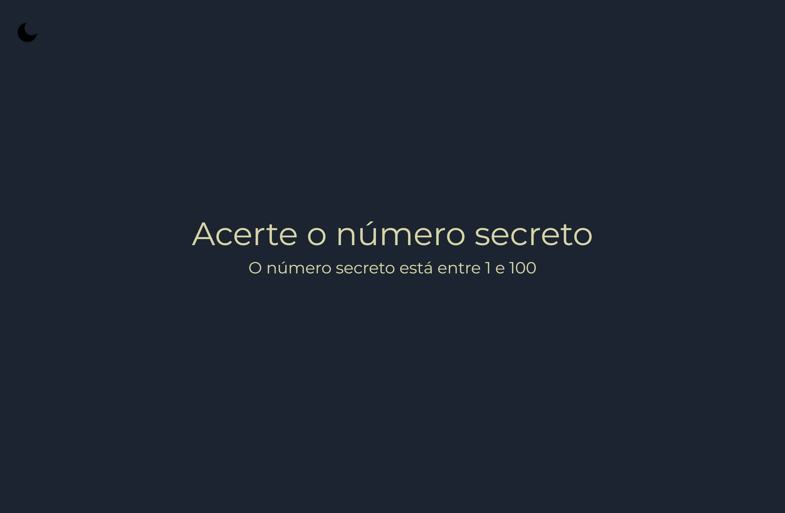

# - Jogo do Número Secreto

# Descrição: 

## Projeto do jogo do número secreto - Alura

### Realizado através de validações e reconhecimento de voz com o Web Speech API.
 

### O programa aleatóriamente irá retornar um número de 1 a 100 e o usuário deverá adivinhar. Utilizando a função Math.random() para a escolha do número, e para o reconhecimento de voz utilizado o Web Speech API. 

### - Você poderá também alterar o tema de cores Dark para Light clicando no icone no canto superior esquerdo.

 

## *  Para poder jogar acesse o link:

https://reissjoao.github.io/jogo-numero-secreto/

 

## Regras: 

- Ter um microfone para o reconhecimento da API

 - Tentar adivinhar um número de 1 a 100

 - Caso o usuário chutar um valor inválido, o erro irá aparecer na tela

----------------------------
 

## Conteúdos abordados:

- Aplicações de validações nos projeto com JavaScript

- Funções build-in do JavaScript

- Reconhecimento de voz com JavaScript

- Manipulação de dados, eventos e elementos com JavaScript 